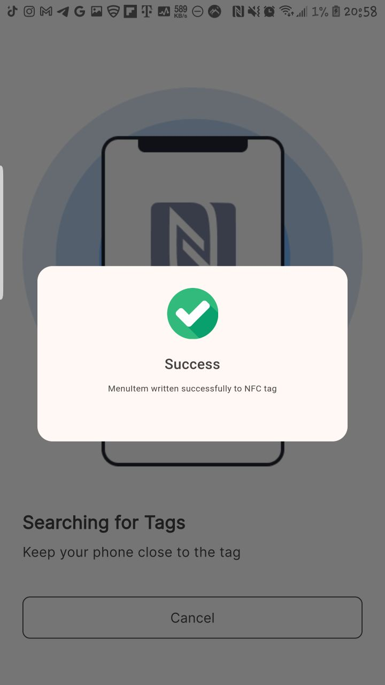

# HNG Mobile Dev: Stage Five Task  - Quick Menu by Kimiko's Place

---


## Table of contents

- [Overview](#overview)
- [Task Requirement](#task-requirement)
- [Solution](#solution)
- [Screenshot](#screenshot)
- [Features](#features)
- [The process](#the-process)
  - [Built with](#built-with)
- [Installation](#installation)
  - [Useful resources](#useful-resources)
- [API Integration](#nfc-near-field-communication)
- [UI/UX](#uiux)
- [Mobile Architecture](#mobile-architecture)
- [Future Improvements](#future-improvements)
- [APK Download](#apk-download)
- [Live Demo Link](#live-demo-link)
- [Author](#authors)
- [Contributing](#contributing)
- [License](#license)

## Overview

This is a solution to the mobile dev stage five task of building an app that reads and writes to the NFC storage device and implementing design made by the product design team.

Objectives: Develop your teams' NFC based idea in a full fledged application with the feature to read and write to NFC tags and collaborate with designers to bring your ideas to life.

## Task Requirement

- Implement your teams’ NFC idea into a working app.
- Your app should have the feature of reading and writing to NFC tags.

### Acceptance Criteria

- Use Only Necessary Third-party Dependencies: Ensure that the application is built using only the necessary third-party packages, plugins, or libraries.
- Intuitive and Adaptive UI: The application should have a user-friendly and intuitive user interface, with clear labelling and spacing.
- Proper README File: it should contain proper setup instructions, app screenshots, apk download link e.t.c.

## Solution

Quick Menu is a restaurant  menu mobile app that transform the dinning experience by using NFC technology to provide customers with instant access to restaurants menus. By placing NFC tags on individual tables, users can simply tap their smartphones on the tag to view detailed and up-to-date menu information. This app enhances convenience, improves accuracy and offers a modern solution for both customers and restaurants admin.

### Screenshot





## Features

- Digital Menu Access: Instantly view the resturant's menu by tapping your phone on an NFC tag placed on the table.
- Splash Screen: An initial loading screen with the app logo that navigates to the home screen after a delay.
- Easy Menu Updates: Restaurants admin can add menu items, prices and categories with ease. It allows restaurant's staff to write menu details on the NFC tags via the app.

## The process

### Built with

- Flutter and Dart

### Lesson learnt

Developing the Quick Menu app provided several valuable insights and lessons, both technical and non-technical, these lessons are summarized in the following bullet point:

- The value of team work and collaboration.
Developers were paired in a team of five to work together to bring this project idea to live.
- Understanding NFC Technology
Integrating the NFC technology required a deep understanding of NFC and handling data transfer.
- State Management
Implementing state management with the Bloc package in Flutter was essential for maintaining and updating the app's state efficiently. This pattern helped in separating the business logic from the UI, making the code more maintainable and scalable.
- Effective UI/UX Design
Creating a user-friendly interface involved using various Flutter widgets to provide a smooth and responsive experience. The pull-to-refresh feature and shimmer loading effect were particularly effective in improving the user experience by providing visual feedback during data loading.
- MVVM Architecture
Adopting the MVVM architecture pattern was a significant step in organizing the codebase. This architecture facilitated a clear separation of concerns, making the app easier to manage and extend.

## Installation

### Prerequisites

- Flutter SDK: [Install Flutter](https://flutter.dev/docs/get-started/install)
- Android Studio or Visual Studio Code: Recommended for development and testing
- A device or emulator to run the app

### Setup Instructions

1.**Clone the repository**

   ```bash
   git clone https://github.com/yourusername/quick_menu.git
   ```
  
2.**Navigate to the project directory**

 ```bash
   cd quick_menu
   ```

3.**Get the required dependencies**

   ```bash
   flutter pub get
   ```

4.**Run the app**

  ```bash
   flutter run
   ```

### Useful resources

For help getting started with Flutter development, view the
[online documentation](https://docs.flutter.dev/), which offers tutorials,
samples, guidance on mobile development, and a full API reference.

Also check out these links to start your first flutter project:

- [Lab: Write your first Flutter app](https://docs.flutter.dev/get-started/codelab)
- [Cookbook: Useful Flutter samples](https://docs.flutter.dev/cookbook)

## NFC (Near Field Communication)

Quick Menu integrates with NFC, NFC (Near Field Communication) is a wireless communication technology that allows the exchange of data between devices over short distances, typically less than 10 centimeters. It operates at a frequency of 13.56 MHz and enables quick, secure transactions and data transfer.

In the context of this project, NFC functionality is utilized to enhance the user experience by providing features such as reading, writing, and editing data on NFC tags. This enables users to interact with physical objects in innovative ways, such as accessing menu items of the restaurant by tapping their phones on NFC-enabled tags.

## UI/UX

Quick Menu provides an intuitive and user-friendly interface:

- Splash Screen: Displays an icon and app name while initializing.
- Menu Screen: List of all menus cutomers can order from.
- Add item Screen: Screen for adding new meal items to the menu.

## Mobile Architecture

Quick Menu follows the MVVM (Model-View-ViewModel) architecture pattern, which separates the business logic from the UI. This architecture enhances code maintainability and testability.

Code Structure:

- Models: Defines the data structures used in the app.
- ViewModels (Providers): Manages the app's data and business logic.
- Views: Contains the UI components and screens.

## Future Improvements

- Enhanced Error Handling: Improving error handling mechanisms to provide more informative feedback to the users and developers.
- Testing: Incorporating unit and integration tests to ensure the app's reliability and catch potential issues early.
- Performance Optimization: Optimizing the app's performance, particularly in handling large datasets and images, to ensure a smooth user experience.
- User Feedback: Gathering user feedback and iterating on the app's features and design based on real-world usage.
- Scalability: Preparing the app for scalability to handle more products, users, and potential new features in the future.

## APK Download

Download the latest version of the app from the link below:

[Download APK](https://drive.google.com/file/d/1JdwPI53pwyiyPIhmv7DT2o7JCPvVxI7w/view?usp=drive_link)
or
Download [here](gitfiles/quick_menu.apk)

## Live Demo Link

Try Quick Menu Demo: [Google drive](https://drive.google.com/file/d/1Ex1-lrMT_AOyKaNm544rLn8R7SOD-Rhe/view)

## Authors

#### Uma Godwin

- Linkedin - [@godwinekeuma](https://www.linkedin.com/in/godwinekeuma)
- Email - [godwinekeuma@gmail.com](godwinekeuma@gmail.com)

#### Iyamu Wisdom

- Linkedin - [@wisdomiyamu](https://www.linkedin.com/in/lukasio)
- Email - [wisdomiyamu@gmail.com](wisdomiyamu@gmail.com)

#### Sakariyah Ibrahim Temitope  

- Linkedin - [@ibrahim-sakariyah](https://www.linkedin.com/in/ibrahim-sakariyah-071380183?utm_source=share&utm_campaign=share_via&utm_content=profile&utm_medium=android_app)
- Email - [ibrahimsakariyah@gmail.com](ibrahimsakariyah@gmail.com)

#### Ijeoma Ogbonna

- Linkedin - [@ogbonnaijeoma](https://www.linkedin.com/in/ijeoma-emmanuella-913050242/)
- Email - [ogbonnaijeoma871@gmail.com](ogbonnaijeoma871@gmail.com)

#### Obor Spicy

- Linkedin - [@israelmenyaga](https://www.linkedin.com/in/israelmenyaga?utm_source=share&utm_campaign=share_via&utm_content=profile&utm_medium=ios_app)
- Email - [dev.izzy.code@gmail.com](dev.izzy.code@gmail.com)

## Contributing

Contributions are welcome! If you'd like to contribute, please follow these steps:

1. Fork the repository
2. Create a new branch: `git checkout -b feature/your-feature-name`
3. Make your changes
4. Commit your changes: `git commit -m 'Add some feature'`
5. Push to the branch: `git push origin feature/your-feature-name`
6. Submit a pull request

Please ensure your code adheres to the existing code style and includes appropriate tests.

## License

This project is licensed under the MIT License - see the [LICENSE](LICENSE) file for details.
